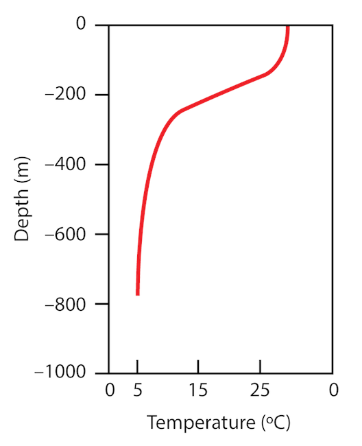
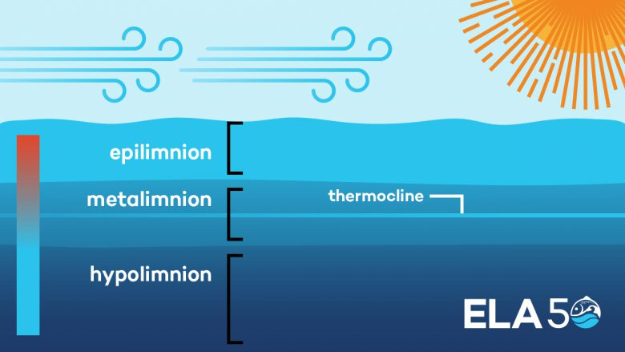
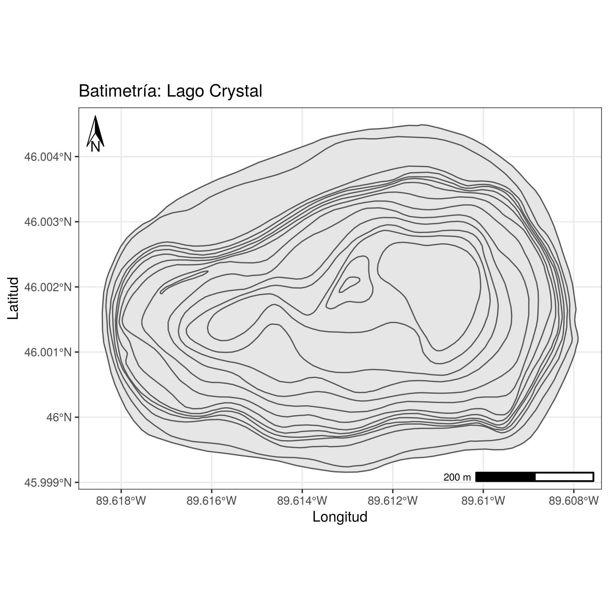

# Estabilidad térmica de la columna de agua {#Termoclina}

Llegados a este punto de la práctica ya podemos adentrarnos en cuestiones más puramente limnológicas. Hemos echado un vistazo a los datos que descargamos y decidimos seleccionar el año 2012. Además, para el eliminar las variaciones diarias y centrarnos en una tendencia estacional, hemos obtenido un perfil promedio del lago Crystal para cada día. Si en el apartado anterior no conseguisteis hacer el promedio diario para todas las variables os dejo el código aquí para que partamos tod\@s desde el mismo punto:

```{r, eval=FALSE}
#Library
library(tidyverse) #Recordad siempre cargar los paquetes que vais a necesitar al inicio del script

#Lo he recogido todo en una sola línea.
Crystal_dia <- Crystal_2012 %>% filter(between(hour(sampledate), 11, 16)) %>% group_by(daynum, depth_calculated) %>% summarise_if(is.numeric, mean, na.rm = TRUE)

#Exportamos los datos
write_csv(Crystal_dia, "Datos/Crystal_dia.csv") #Guardamos la información en un archivo
```

```{r, echo=FALSE, message=FALSE}
#Library
library(tidyverse)

Crystal_dia <- read_csv("Datos/Crystal_dia.csv")
```

## Perfil vertical

Todavía no hemos visualizado lo que acabamos de hacer. Vamos a ver como ha quedado la tabla.

```{r}
Crystal_dia
```

Tiene justo lo que queríamos. Vamos a representar el perfil vertical de temperatura para un día concreto.

```{r}
#Elegimos un día
Dia_elegido <- Crystal_dia %>% filter(daynum == 200)

#Representamos
ggplot(Dia_elegido, aes(x= depth_calculated, y = water_temp))+
  geom_point()+
  labs(x = "Profundidad (m)", y = "Temperatura (ºC)")
```
 
Tiene buena pinta pero es extraño. Nosotr\@s estamos acostumbrados a ver los perfiles así:

```{r, echo=FALSE,fig.cap="Representación clásica de un perfil vertical de temperatura.",fig.show='hold',fig.align='center'}

``` 

Pues vamos a hacer algunos cambios en el código para mejorar esto.

```{r}
ggplot(Dia_elegido, aes(y= depth_calculated, x = water_temp))+
  geom_point()+
  scale_y_reverse()+ # Invertimos la profundidad para que la parte superior sea 0 metros.
  scale_x_continuous(position = "top")+ #Colocamos el eje arriba
  labs(x = "Temperatura (ºC)", y = "Profundidad (m)")+
  theme_classic()
```

Esto tiene mejor pinta. Prueba a usar `geom_line()` en lugar de `geom_point()`. Sucede algo extraño entorno a los 5 metros de profundidad ¿verdad? Esto sucede porque `geom_line()` une las observaciones ordenadas por la variable `x`. Prueba mejor con `geom_path()`. Otra opción es asignar la profundidad al eje x y cambiar los ejes (es un poco lioso, os dejo el código por si queréis indagar).

```{r}
ggplot(Dia_elegido, aes(x= depth_calculated, y = water_temp))+
  geom_line()+
  coord_flip()+ #Cambia el eje x por el y
  scale_x_reverse()+ # Invertimos la profundidad para que la parte superior sea 0 metros.
  scale_y_continuous(position = "right")+
  labs(x = "Profundidad (m)", y = "Temperatura (ºC)")
```


Quitando esta curiosidad con respecto a como se representan las variables, ya tenemos nuestro perfil vertical de temperatura:

```{r}
ggplot(Dia_elegido, aes(y= depth_calculated, x = water_temp))+
  geom_path(color = "gray", size = 3)+ #Cambiamos un poco la estética dándole color y grosor a la línea
  scale_y_reverse()+ # Invertimos la profundidad para que la parte superior sea 0 metros.
  scale_x_continuous(position = "top")+ #Colocamos el eje arriba
  labs(x = "Temperatura (ºC)", y = "Profundidad (m)")+
  theme_classic()
```

### Ejercicio

  1. *Haz un perfil con la concentración de oxígeno disuelto y otro con el pH.*

## Termoclina

Ahora, en base a el perfil de temperatura que hemos representado, ¿sabrías si este día el lago está estratificado? Si estuviera estratificado, ¿serías capaz de decir a que profundidad se encuentra la termoclina?

A ojo podríamos acercarnos bastante pero imaginad que luego quisiéramos calcularlo para cada día... Gracias al altruismo y la ciencia colaborativa tenemos a nuestra disposición un paquete desarrollado especialmente para este tipo de cosas que nos gustan a los limnolog\@s. El paquete es [`rLakeAnalyzer`](https://cran.r-project.org/web/packages/rLakeAnalyzer/rLakeAnalyzer.pdf) y contiene métodos estandarizados para calcular propiedades físicas del lago, como la termoclina, la estabilidad de Schmidt, etc. Para instalarlo: `install.packages("rLakeAnalyzer")`. Si echáis un vistazo al paquete veréis un montón de funciones interesantes. Nosotros, ahora mismo, queríamos saber a que profundidad tenemos la termoclina. Para eso, vamos a pedir ayuda para aprender a usar la función `?thermo.depth()`. Aquí podemos ver los argumentos que necesitamos. Por ejemplo, podemos indicarle la densidad mínima para considerar que existe termoclina o la temperatura por debajo de la cual no queremos que  calcule termoclina. No vamos a reparar en estos. Sin embargo, el argumento `seasonal` viene por defecto como verdadero, situando la termoclina en el gradiente de densidad más profundo. Nosotros vamos a cambiarlo a `FALSE`. Estos son argumentos opcionales, los indispensables son un vector numérico con la temperatura del agua (`wtr`) y otro vector numérico con la profundidad que corresponde a cada temperatura. Estos los tenemos, así que nos podemos poner manos a la obra:

```{r}
#Library
library(rLakeAnalyzer)
#Creamos dos vectors con la información que nos pide
Temp <- Dia_elegido$water_temp
Prof <- Dia_elegido$depth_calculated

#Calculamos la termoclina
thermo.depth(wtr = Temp, depths = Prof, seasonal = FALSE)
```

¡Voilá! Ya tenemos la profundidad a la que está la termoclina. Vamos a representarla:

```{r}
#Vamos a guardar la profundidad de la termoclina en un objeto
Termoclina <- thermo.depth(wtr = Temp, depths = Prof, seasonal = FALSE)

ggplot(Dia_elegido, aes(y= depth_calculated, x = water_temp))+
  geom_path(color = "gray", size = 3)+ #Cambiamos un poco la estética dándole color y grosor a la línea
  geom_hline(yintercept = Termoclina)+ #Añadimos la termoclina
  scale_y_reverse()+ # Invertimos la profundidad para que la parte superior sea 0 metros.
  scale_x_continuous(position = "top")+ #Colocamos el eje arriba
  labs(x = "Temperatura (ºC)", y = "Profundidad (m)")+
  theme_classic()
```

## Capas en un lago estratificado

Como sabéis, cuando un lago (o un embalse) se encuentra estratificado se puede diferenciar en distintas capas. Una capa superficial, que está mezclada y en contacto con la atmósfera, el **epilimnion**, otra capa profunda, aislada de la superior debido al fuerte gradiente de densidad, el **hipolimnion** y una capa intermedia que hace de interfase entre estas dos capas, el **metalimnion**. Esto determinan los procesos que tendrán lugar a cada profundidad. La capa superficial al estar en contacto con la atmósfera estará bien oxigenada y dará lugar a que se desarrolle la vida aeróbica sin problemas. La capa profunda, sin embargo, puede acabar volviéndose anóxica y limitando la degradación de la materia orgánica a mecanismos de respiración anaeróbica (desnitrificación, sulfato reducción, etc) y acumulando metales que pueden ser tóxicos y comprometer su uso para abastecimiento humano. Por lo tanto, si estamos estudiando un sistema estratificado es clave reconocer y definir estás capas. 

```{r, echo=FALSE,fig.cap="Esquema de un lago estratificado. Fuente: IISD Experimental Lakes Area (IISD-ELA).",fig.show='hold',fig.align='center'}

``` 

Para determinar donde empiezan y donde acaban estas capas, el paquete `rLakeAnalyzer` dispone de un función, `meta.depths()`. Si leemos la información sobre la función vemos que nos devuelve el límite superior e inferior del metalimnion, que a su vez son el limite inferior del epilimnion y el límite superior del hipolimnion. Además, los argumentos obligatorios son los mismo que usamos con `thermo.depth()`. Así que podemos aplicarla sin problemas.

```{r}
meta.depths(wtr = Temp, depths = Prof, seasonal = FALSE)
```

¡Perfecto! Vamos a representarlo todo junto.

```{r}
#Guardo los límites del metalimnion
metalimnion <- meta.depths(wtr = Temp, depths = Prof, seasonal = FALSE)

ggplot(Dia_elegido, aes(y= depth_calculated, x = water_temp))+
  geom_path(color = "gray", size = 3)+ #Cambiamos un poco la estética dándole color y grosor a la línea
  geom_hline(yintercept = Termoclina)+ #Línea en la termoclina
  geom_hline(yintercept = metalimnion, linetype = 2)+ #Líneas discontinuas defininedo el metalimnion
  scale_y_reverse()+ # Invertimos la profundidad para que la parte superior sea 0 metros.
  scale_x_continuous(position = "top")+ #Colocamos el eje arriba
  labs(x = "Temperatura (ºC)", y = "Profundidad (m)")+
  theme_classic()
```

### Ejercicios

1. Prueba a cambiar el argumento `seasonal`. ¿Qué sucede?
2. ¿Podrías calcular la profundidad de la termoclina para todos los días del año en el lago Crystal?

```{r, eval = FALSE, include=FALSE}
termoclinas <- Crystal_dia %>% group_by(daynum) %>% transmute(termoclina = thermo.depth(water_temp, depth_calculated))

```

## Estabilidad

La estabilidad de la columna de agua nos va a dar una idea sobre su tendencia a mezclarse o permanecer estratificada. Uno de los índices utilizados para representar la estabilidad de la masa de agua en un lago es el índice de estabilidad de Schmidt. Este indice da un valor sobre la energía que tendríamos que aplicar sobre la superficie para mezclar la columna de agua. Las unidades son, por lo tanto, J/m².

El paquete `rLakeAnalyzer`también nos provee de una función para calcular la estabilidad de Schmidt, `schmidt.stability()`. Echar una ojeada a como se usa.

Si os habéis fijado, en este caso, a parte de la temperatura y la profundidad, necesitamos darle información sobre la batimetría del lago. `bthA` es el área que tiene cada capa a una determinada profundidad `bthB`. Quizás lo veis mejor en la siguiente imagen.

```{r, echo=FALSE,fig.cap="Batimetría del lago Crystal.",fig.show='hold',fig.align='center'}

``` 

Pues bien, a priori, no disponemos de esta información. Quizás buscando en la base de datos de GLEON podríamos encontrar la batimetría del Lago Crystal. De hecho, está pero en un archivo .shp y deberíamos calcular el área. Todo esto se puede hacer con R (de hecho, la imagen de arriba está hecha con R)pero no vamos a abrir esa puerta ahora, ya tenemos bastante...

De nuevo, el paquete `rLakeAnalyzer` nos proporciona la solución a nuestros problemas. Existe una función para estimar la curva área-profundidad (también conocida como curva hipsográfica) para un lago. Sólo tenemos que proporcionarle el área de la superficie del lago, la profundidad máxima y la profundidad media. Toda esta información la tenemos disponible en la página de NTL-LTER (North Temperate Lakes US Long-Term Ecological Research Network). Podéis pinchar [aquí](https://lter.limnology.wisc.edu/researchsite/crystal-lake). La profundidad máxima es de 20.4 m, la superficie del lago es de 367000 m² y la profundidad media es de 11.4 m. ¡Al lío!

```{r}
#Estimamos la batimetría
approx.bathy(Zmax = 20.4, lkeArea = 367000, Zmean = 11.4) 
```

Ahora ya tenemos toda la información necesaria para calcula la estabilidad de Schmidt.

```{r}
#Guardamos la estimación en un objeto
Batimetria <- approx.bathy(Zmax = 20.4, lkeArea = 367000, Zmean = 11.4)

#Calculamos la estabilidad de Schmidt
schmidt.stability(wtr = Temp, depths = Prof, bthA = Batimetria$Area.at.z, bthD =  Batimetria$depths)
```

La estabilidad de Schmidt para el día 200 es de 121.69 J/m². Este número nos puede decir poco pero... ¿y si comparamos distintos días?

### Ejercicios

1. *¿Para qué sirve el argumento `method` de la función `approx.bathy()`? ¿Qué efecto tiene?*
2. *Vamos a comparar la estabilidad de Schmidt para tres días: el primero que tenemos de 2012, el día 200 y el último que tenemos para 2012.*

## Series temporales

Las funciones que hemos visto hasta ahora del paquete `rLakeAnalyzer` las hemos aplicado a perfiles vertical de un día en concreto. En uno de los ejercicios os animé a calcularais la termoclina para cada día del año 2012. Gracias al paquete `dplyr`esta tarea no es realmente complicada. Sin embargo, el paquete `rLakeAnalyzer` posee una versión de cada una de la funciones que hemos visto pero que se puede aplicar a series temporales como la que nosotros tenemos. Echad un vistazo a `?ts.thermo.depth`.
Si os dais cuenta, el único inconveniente en que nos piden una estructura de los datos concreta. Para poder aplicarla tenemos que reorganizar la tabla. La tabla tiene que tener una columna llamada datetime con formato de fecha en lugar de día del año y una columna para cada profundidad.
Lo primero que vamos a hacer es quedarnos solamente con la información del día, de la profundidad y de la temperatura del agua.
 
```{r}
#Seleccionamos las variable que nos interesan
Crystal_temp <- Crystal_dia %>% select(daynum, depth_calculated, water_temp)
```

Una vez que hemos seleccionado sólo lo que nos interesa, vamos a convertirlo a forma ancho usando la función `spread()`.

```{r}
#Mantenemos la fecha y convertimos la profundidad en variables (columnas) incluyendo el valor de temperatura en cada columna.
Crystal_ts <- Crystal_temp %>% spread(key = depth_calculated, value = water_temp)
```

Vamos a convertir el día del año en formato fecha y a cambiarle el nombre a las columnas.

```{r}
#Convertimos los días del año en fechas
Crystal_ts <- Crystal_ts %>% mutate_at(vars(daynum), as.Date, origin = "2012-01-01")
#Cambiamos el nombre de la columna "daynum" a "datetime"
Crystal_ts <- Crystal_ts %>% rename(datetime = daynum)
#Añadimos "wtr_" delante del número de cada profundidad
Crystal_ts <- Crystal_ts %>% rename_if(is.numeric, ~paste("wtr_", ., sep = ""))
Crystal_ts
```

Ya tenemos los datos ordenados para aplicar la función `ts.thermo.depth()`. Ahora vamos a intentar calcular la profundidad de la termoclina para cada día.

```{r}
termoclina_diaria <- ts.thermo.depth(Crystal_ts)
```

Vemos que tenemos muchos días con valor `NA`. Esto se debe a que si la función encuentra un valor de `NA`en el perfil de temperatura devuelve `NA`. Para evitar esto podemos añadir el argumento `na.rm = TRUE`.

```{r}
termoclina_diaria <- ts.thermo.depth(Crystal_ts, na.rm = TRUE)
```

Ahora vamos a guardar la información en la carpeta `Datos`.

```{r}
#Guardamos los perfiles de temperatura de cada día
write_csv(Crystal_ts, "Datos/Crystal_ts.csv")
#Guardamos la profundidad de la termoclina
write_csv(termoclina_diaria, "Datos/Termoclina.csv")
```

### Ejercicios

  1. *Representa la profundidad de la termoclina para cada día.*
  2. *Calcula la estabilidad de Schmidt para todos los días.*
  3. *Representa el valor de la estabilidad de Schmidt para cada día.*
  4. *Calcula los límites del metalimnion para todos los días.*
  
```{r, eval = FALSE, echo = FALSE}
#Solución
#1
ggplot(termoclina_diaria, aes(x= datetime, y = thermo.depth))+
  geom_point()+
  theme_classic()
#2
Batimetria <- Batimetria %>% rename(areas = Area.at.z)
Estabilidad <- ts.schmidt.stability(Crystal_ts, Batimetria, na.rm = TRUE)
#3
ggplot(Estabilidad, aes(x= datetime, y = schmidt.stability))+
  geom_point()+
  theme_classic()
#4
metalimnion_diario <- ts.meta.depths(Crystal_ts, na.rm = TRUE)
```


