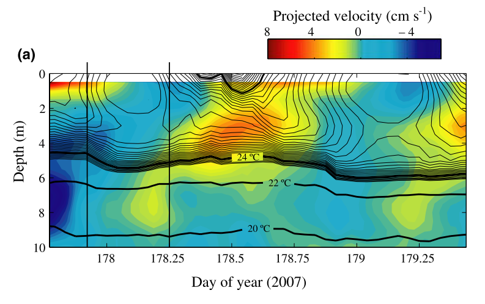

# Gráficas de contorno {#Contour}

Por último y aprovechando que tenemos información diaria de la temperatura del lago a distintas profundidades, quizás, sería interesante realizar una gráfica de contorno del periodo estudiado. Estas gráficas son muy visuales y ayudan a entender mejor el comportamiento del lago. Las vemos a menudo en los artículos.

```{r, echo=FALSE,fig.cap="Imagen ejemplo de gráfica de contorno extraída de @Vidal2010.",fig.show='hold',fig.align='center'}

``` 

Existen distintos programas que permiten hacer estas gráficas como son Surfer, SigmaPlot o OceanDataView, con el inconveniente que la mayoría de ellos son privativos y de pago (OceanDataView se salva!). Además, ya estamos metidos en harina y, como hemos dicho anteriormente, R nos permite trabajar desde los datos crudos hasta la generación de gráficas e informes (estos documentos están hechos directamente desde R).

Vamos a partir de la tabla de datos en formato "ancho" que creamos para calcular la profundidad de la termoclina `Crystal_ts`.

```{r}
#Cargamos tidyverse si cerramos la sesión anterior
library(tidyverse)
#Importamos los datos de temperatura
Crystal_ts <- read_csv("Datos/Crystal_ts.csv")
```

Cuando transformamos el objeto a formato "ancho" homogeneizamos las profundidades a las que tenemos datos de temperatura. Es decir, tenemos el mismo número de medidas y a las mismas profundidades para cada momento. Sin embargo, como los datos no estaban completos se han introducidos NAs en aquellas profundidades donde no teníamos información. Por ejemplo, en el perfil del 2012-03-27, tenemos datos de temperatura a 4 y a 9 metros pero no para las profundidades entre 5-8 m. Para solucionar esto, podemos interpolar los datos. Para ello, vamos a usar un nuevo paquete, [`zoo`](https://cran.r-project.org/web/packages/zoo/zoo.pdf).

```{r, eval = FALSE, echo = FALSE}
#Interpolamos
  Crystal_ts <- Crystal_ts %>% select(-wtr_0) #Eliminamos la profundidad 0 porque hay mucha variación debido a los cambios día noche.
```

```{r}
#Cargamos el paquete. Tiene que estar previamente instalado
library(zoo)

#Interpolamos y extrapolamos (rule = 2) la temperatura para las profundidades que nos faltan.
  Crystal_ts[,-1] <- na.approx(Crystal_ts[,-1],rule = 2)
```

Ahora podemos devolver los datos a su formato largo.

```{r}
#Cargamos el paquete tidyverse
  library(tidyverse)
#Devolvemos la tabla al formato "largo"
  Temp_largo <- gather(Crystal_ts, key = "depth", value = "wtemp", -datetime)
#Le quitamos "wtr_" a la variable profundidad para que se quede sólo los números.
  Temp_largo <- Temp_largo %>% mutate(depth = parse_number(depth))
```

E intentamos representar.

```{r}
ggplot(Temp_largo, aes(x = datetime, y = depth, color = wtemp))+
  geom_point()
```

Parece que estamos bastante cerca, sin embargo, hay muchos huecos en blanco. Para solucionar esto vamos a crear una matriz y a usar una interpolación espacial multinivel b-spline para completar la información que nos falta. Para esto, usamos el paquete [MBA](https://cran.r-project.org/web/packages/MBA/MBA.pdf).

```{r}
#Cargamos lubridate, aunque viene con tidyverse hay que "llamarlo" a parte.
  library(lubridate)
#Primero tenemos que convertir las fechas en un vector numérico
  Temp_largo$datetime <- decimal_date(Temp_largo$datetime)
#Cargamos el paquete MBA, hay que instalarlo previamente.
  library(MBA)
# Aquí creamos una matriz con mayor resolución usando una interpolación espacial multinivel b-spline
Temp_mba <- mba.surf(Temp_largo, no.X = 500, no.Y = 500, extend = T)
#Aquí están las fecha con la nueva resolución (en este caso es mayor de la que teniamos, 500 "perfiles", frente a los 189 que teníamos)
head(Temp_mba$xyz.est$x)
#Aquí tenemos las nuevas profundidades, 500 profundidades en lugar de las 19 que teniamos antes
head(Temp_mba$xyz.est$y)
#Estos son los datos de temperatura
head(Temp_mba$xyz.est$z)[1:10]
#Los juntamos todos
Temp_prof <- as.data.frame(Temp_mba$xyz.est$z)
colnames(Temp_prof) <-  Temp_mba$xyz.est$y
Temp_prof <- bind_cols(date = Temp_mba$xyz.est$x, Temp_prof)
#Y los volvemos al formato largo.
Temp_mba <- gather(Temp_prof, key = "depth", value = 'temp', -date) %>%  mutate(temp = round(temp, 3))

#Ponemos la profundidad en numérico, se nos había quedado como carácter
Temp_mba <- Temp_mba %>% mutate(depth = as.numeric(depth))

#Esta es la pinta de los datos:
head(Temp_mba)
```

Ahora representamos de nuevo.

```{r}
ggplot(Temp_mba, aes(x = date, y = depth, color = temp))+
  geom_point()
```

¡Mucho mejor! Vamos a cambiar algunos aspectos estéticos para que quede más resultona.

```{r}
#Vamos a devolverle el formato de fecha
Temp_mba$date <- date_decimal(Temp_mba$date)
#Cargamos un paquete para usar una paleta de color má común
library(colorRamps)
Grafica_temp <- ggplot(data = Temp_mba, aes(x = date, y = depth)) +
  geom_tile(aes(fill = temp)) + #Usamos esta capa que viene mejor para este tipo de gráficos pero podíamos haber usado geom_point
  scale_y_reverse()+
  scale_fill_gradientn(colours = matlab.like2(10)) +
  geom_contour(aes(z = temp), binwidth = 1, colour = "black", alpha = 0.2) +
  labs(y = "Profundidad (m)", x = NULL, fill = "temp. (°C)") +
  coord_cartesian(expand = 0)
Grafica_temp
```

Hemos cambiado el formato de la fecha, hemos invertido el eje profundidad para que se más intuitivo, hemos cambiado las etiquetas, el color y añadido unas lineas de contorno.

Vamos a probar a añadirle la profundidad de la capa de mezcla.

```{r, error = TRUE}
Termoclina <- read_csv("Datos/Termoclina.csv")

  Grafica_temp_zmix <- Grafica_temp + geom_line(data = Termoclina, aes(x=datetime, y = thermo.depth, color = "Termoclina"), size = 0.2)+
  scale_color_manual(values = "black") + labs(color = NULL)
  
  Grafica_temp_zmix
```

¡Vaya! Tenemos un error. Esto saca de quicio pero os iréis acostumbrando, poco a poco empezaréis a comprender que quiere decir el mensaje de error y buscar en qué os habéis equivocado. En este caso, el error nos dice que al transforma un objeto de tiempo no ha podido porque trabaja con objetos de clase POSIXct. Si os fijáis en el data.frame que usamos para hacer la gráfica de contorno (`Temp_mba`) la fecha está en formato `POSIXct` y en el data.frame de `Termoclina` está en formato `Date`. Sólo tenemos que cambiar el formato de este último y estará solucionado.

```{r}
Termoclina <- Termoclina %>% mutate(datetime = as.POSIXct(datetime))

Grafica_temp_zmix <- Grafica_temp + geom_line(data = Termoclina, aes(x=datetime, y = thermo.depth, color = "Termoclina"), size = 0.2)+
  scale_color_manual(values = "black") + labs(color = NULL)
  
  Grafica_temp_zmix
```

Como vemos hay cierta oscilación en la termoclina y sobretodo en los momentos en lo que la estratificación está comenzando o se está rompiendo. A rasgos generales podemos decir que la estratificación comienza a finales de mayo y se prolonga hasta mediados de agosto. A mediados de agosto vemos que se rompe la estratificación y vuelve a estratificarse suavemente pero a mediados de septiembre el lago está totalmente mezclado con las isotermas totalmente verticales. Si queremos, para visualizar la termoclina podemos usar un suavizado:

```{r}
Grafica_temp_zmix <- Grafica_temp + geom_smooth(data = Termoclina, aes(x=datetime, y = thermo.depth, color = "Termoclina"), size = 0.2, na.rm = TRUE, se = FALSE)+
  scale_color_manual(values = "black") + labs(color = NULL)
  
  Grafica_temp_zmix
```


Y ya la tenemos lista para exportar. Podéis guardarla en el formato que más os guste (.jpeg, .pdf, .bmp, ...) simplemente cambiando el nombre con el que lo guardáis o indicándolo con el argumento `device`. Además también podéis fijar el ancho y el largo, así como otras opciones que podéis ver en `?ggsave()`.

```{r, eval = F}
ggsave("./Graficas/Grafica_temp.png", Grafica_temp_zmix, width = 20, height = 10, units = "cm")
```

### Ejercicios

  1. *Añade el límite superior e inferior del metalimnion a la gráfica `Gráfica_temp`.*
  2. *Haz una gráfica de contorno para el oxígeno disuelto.*
  
```{r, include = FALSE}
#Contour plot
Metalimnion <- read_csv("Datos/Metalimnion.csv")

Metalimnion <- Metalimnion %>% mutate(datetime = as.POSIXct(datetime))

Grafica_temp_zmix <- Grafica_temp + geom_smooth(data = Metalimnion, aes(x=datetime, y = top, color = "Superior"), size = 0.2, na.rm = T, se = FALSE)+
  geom_smooth(data = Metalimnion, aes(x=datetime, y = bottom, color = "Inferior"), size = 0.2, na.rm = T, se = FALSE)+
  scale_color_manual(values = c("black", "white")) + labs(color = NULL)
  
  Grafica_temp_zmix
```
