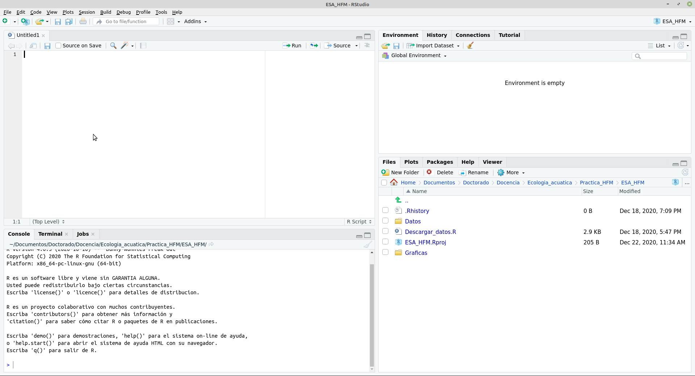
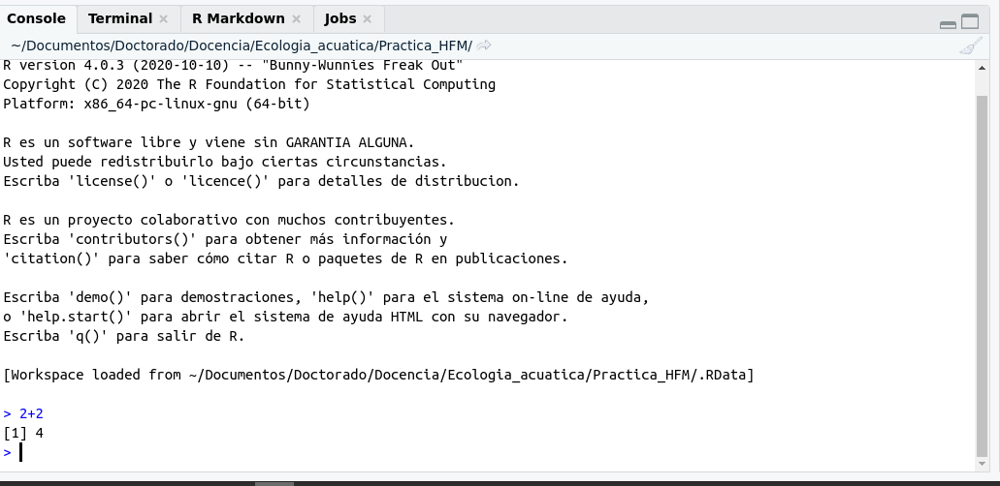

```{r setup, include=FALSE}
knitr::opts_chunk$set(echo = TRUE)
```

## Primero pasos

A estas alturas es posible que ya se haya generado una histeria colectiva. A la mayoría de vosotr\@s ya os habrá dado algún error y, a l\@s que no, esa cantidad de código ininteligible os habrá quitado las ganas de vivir. ¡Que no cunda el pánico!

Vamos a ver alguna nociones básicas sobre R. Si os preguntáis porqué ahora y no antes: porque hasta que no surgen las dudas, no tiene sentido dar las respuestas.



RStudio es una IDE (entorno de desarrollo integrado) para R. En román paladino, RStudio nos permite usar R de una manera más intuitiva y con muchas herramientas que nos facilitan la vida. Como vamos usar RStudio para comunicarnos con R, cada vez que hablemos de R vamos a referirnos indistintamente a R y a RStudio. Bien, pues en la imagen de arriba vemos 4 subventanas. Veamos una a una:


En esta ventana se muestra el script. El script no es, ni más ni menos, que una hoja donde vamos escribiendo todas las ordenes que le queremos dar a R. Nos permite ir guardando todo lo que hacemos, modificar sobre lo que ya hemos hecho, ejecutar sólo la parte que nos interesa y organizar la información. Vamos a escribir nuestra primera línea en R, usándolo como una simple calculadora (pincha sobre el recuadro `code` para ver el código):

```{r}
2+2
```

Si escribís 2+2 y pulsáis `Ctrl+Enter` se ejecuta solo la línea en la que estamos. Veréis que el resultado (4) os aparece en la ventana consola:



Como podéis intuir la consola es donde tiene lugar la parte importante. En ella se ejecutan las ordenes, nos informa de los errores y nos devuelve la información que le pedimos.

Volvamos al script. R es una lenguaje orientado a objetos, esto se traduce en que vamos a ir guardando la información en "objetos" virtuales y vamos a trabajar con estos objetos. Siguiente el ejemplo anterior, vamos a crear nuestros primeros objetos:

```{r}
x <- 2
y <- 2
```

Hemos creado dos objetos, una llamado `x` y otro llamado `y`. Ambos guardan la información del valor 2. Además, si os habéis fijado, en la ventana superior derecha os han aparecido esos dos objetos:


Ahora vamos a sumar estos dos objetos:

```{r}
x+y
```

¡Enhorabuena! ya habéis creado vuestro primeros objetos en R y habéis trabajado con ellos. Ahora vamos a sacarle más partido a esto. Como imaginaréis, en un objeto de R se puede almacenar muchas más información que un sólo número. Vamos a imaginar que tenemos información sobre la temperatura del agua medida en distintos sistemas epicontinentales y queremos guardar esa información en un objeto llamado `Temperatura`:

```{r}
Temperatura <- c(23, 23.5, 20, 25)
```

Ahora vamos a calcular la temperatura media y su desviación:

```{r}
mean(Temperatura)
sd(Temperatura)
```

¡Ojo! R es muy quisquilloso y si no le dais el nombre exacto de `Temperatura` (incluyendo mayúculas y minúsculas) no os entenderá y os devolverá un error. Por lo tanto, sed muy cuidadosos con la sintaxis y revisad que todo está escrito correctamente (que no falte ningún paréntesis o corchete).

En estas últimas líneas han sucedido un par de cosas: hemos creado un objeto nuevo, un vector, y hemos usado dos funciones `mean()` y `sd()` que calculan la media y desviación estándar.

Un vector almacena información de un mismo tipo, en este caso númerico. Existen distintos tipos de vector en función de la información que almacen:

  1. Númerico: almacenan números.
  2. Caracter: almacenan texto.
  3. Factores: almacenan factores, generalmente texto pero que usaremos como un tratamiento en el análisis. 
  4. Fechas: almacenan fechas en distintos formatos.
  
En cuanto a las funciones, existen infinidad de ellas. R trae muchas funciones básicas pero si queremos aplicar funciones más especificas necesitaremos instalar paquetes que han sido creados específicamente para ello.

La estructura genérica de una función sería. 

```{r, eval = F}
nombre_funcion(x = objeto_donde_aplicarla, argumento1 = "valor1", argumento2 = "valor2")
```

Si queremos obtener más información sobre una función y su uso podéis usar la función `help("funcion_que_os_interesa")` o más cómodo `?funcion_que_os_interesa`:

```{r}
?mean
```
  
Veréis que se os abrirñá la última ventana que nos quedaba por ver:


Aquí encontréis la información necesaria para usar la función así como algunos ejemplos.

Por último, vamos a ver otro objeto muy útil: `data.frame`. Un data.frame no es más que una tabla de datos, como la que acostumbráis a hacer en Excel. Veamos un ejemplo:

Ya tenemos la temperatura del agua que se ha registrado en distintos sistemas epicontinentales (`Temperatura`). Ahora nos dan la información del tipo de sistema y queremos crear un tabla que recoja toda la información:

```{r}
Temperatura <- c(23, 23.5, 20, 25)
Sistemas <- c("Lago", "Lago", "Rio", "Rio") #Creamos un vector esta vez de tipo caracter (el texto va entre comillas)

Temperatura_en_distintos_sistemas <- data.frame(Temperatura,
                                                   Sistemas)
View(Temperatura_en_distintos_sistemas) #La función View() nos muestra el objeto que deseemos.
```

Se os abrirá una ventana con la información recogida en el data.frame `Temperatura_en_distintos_sistemas`. En este último trozo de código habeís visto un elemento nuevo: comentarios. Es altamente recomendado comentar el código que estamos escribiendo. De este modo, será mucho más claro y cuando vuelvas a abrir el script después de meses "tu yo del futuro" te lo agradecerá. Además si queréis compartir código con otr\@s compañer\@s es necesario añadir comentarios para que sepan que hacemos en cada sección. Para comentar, como habéis visto, sólo hay que añadir `#` delante del texto y este no se ejecutará. Si no ponéis `#` R lo entenderá como una orden y os dará error.

Otra cosa que habréis podido notar es que, aunque R nos ayuda autocompletando la frase, el nombre `Temperatura_en_distintos_sistemas` no es muy funcional que se diga. Es más práctico usar nombres cortos, pero nos indiquen claramente de que se trata, a la hora de nombrar objetos en R. 

A la hora de nombrar objetos en R algunas nombres que debemos respetar.

  1. Los nombres no pueden ser números o empezar con número. No podríamos usar `1` ó `2` ni `2datos`, pero sí podríamos usar `datos2`.
  2. No se usar caracteres especiales: #, !, @, etc.
  3. Los espacios tampoco pueden ser usado dentro de los nombres. Usar en su lugar mayúsculas ó barra baja. Por ejemplo, usar `DatosLagos` o `Datos_lagos` en lugar de `Datos lagos`.

```{r}
Temperatura <- c(23, 23.5, 20, 25)
Sistemas <- c("Lago", "Lago", "Rio", "Rio") #Creamos un vector esta vez de tipo caracter (el texto va entre comillas)

Temp_sistemas <- data.frame(Temperatura,
                                                   Sistemas)
View(Temperatura_en_distintos_sistemas) #La función View() nos muestra el objeto que deseemos.
```

¡Genial! Ya hemos visto los objetos básicos. Irán saliendo a lo largo de la práctica, pero por ahora es suficiente.

## Ejercicios

  1. ¿Qué sucede si corremos `Sistemas[2]`? Prueba con distintos números.
  2. ¿Y si corremos Temp_sistemas[2]? Da error... prueba Temp_sistemas[,2] ¿Y si ponemos un número delante de la `,`? ¿Que indican los números que van delante de la coma y los que van detrás?
  3. Además de la temperatura se midió el pH: 7.8, 7.5, 9 y 8.5. Incluye estos valores en el data.frame `Temp_sistemas`. Hazlo con los conocimientos que tienes y luego prueba con la función `cbind()`.
  2. Nos dan también la concentración de clorofila a, pero en este caso falta un datos y lo rellenamos con `NA`, que significa que no está disponible. `Cla <- c(15.6, NA, 3, 4)`. Calcula la concentración de clorofila media. Recuerda, cuando tengas dudas sobre como utilizar una función: `?mean`.
