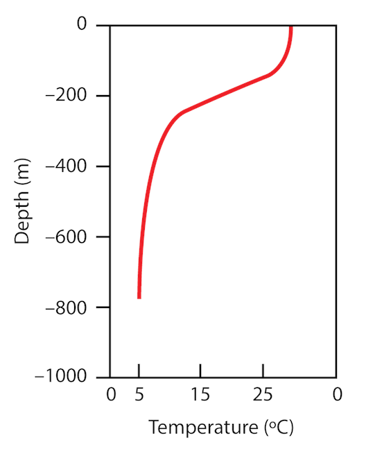

```{r setup, include=FALSE}
knitr::opts_chunk$set(echo = TRUE)
```

# Estabilidad térmica de la columna de agua

Llegados a este punto de la práctica ya podemos adentrarnos en cuestiones limnológicas. Hemos echado un vistazo a los datos que descargamos y decidimos seleccionar el año 2012. Además, para el eliminar las variaciones diarias y centrarnos en una tendencia estacional, hemos obtenido un perfil promedio del lago Crystal para cada día. Si en el apartado anterior no conseguisteis hacer el promedio diario para todas las variables os dejo el código aquí para que partamos tod\@s desde el mismo punto:

```{r, eval=FALSE}
#Library
library(tidyverse) #Recordad siempre cargar los paquetes que vais a necesitar al inicio del script

#Lo he recogido todo en una sola línea.
Crystal_dia <- Crystal_2012 %>% filter(between(hour(sampledate), 11, 16)) %>% group_by(daynum, depth_calculated) %>% summarise_if(is.numeric, mean, na.rm = TRUE)

#Exportamos los datos
write_csv(Crystal_dia, "Datos/Crystal_dia.csv") #Guardamos la información en un archivo
```

```{r, echo=FALSE, message=FALSE}
#Library
library(tidyverse)

Crystal_dia <- read_csv("Datos/Crystal_dia.csv")
```

Todavía no hemos visualizado lo que acabamos de hacer. Vamos a ver como ha quedado la tabla.

```{r}
Crystal_dia
```

Tiene justo lo que queríamos. Vamos a representar el perfil vertical de temperatura para un día concreto.

```{r}
#Elegimos un día
Dia_elegido <- Crystal_dia %>% filter(daynum == 200)

#Representamos
ggplot(Dia_elegido, aes(x= depth_calculated, y = wtaer_temp))+
  geom_point()+
  labs(x = "Profundidad (m)", y = "Temperatura (ºC)")
```
 
Tiene buena pinta pero es extraño. Nosotr\@s estamos acostumbrados a ver los perfiles así:



Pues vamos a hacer algunos cambios en el código para mejorar esto.

```{r}
ggplot(Dia_elegido, aes(y= depth_calculated, x = wtaer_temp))+
  geom_point()+
  scale_y_reverse()+ # Invertimos la profundidad para que la parte superior sea 0 metros.
  scale_x_continuous(position = "top")+ #Colocamos el eje arriba
  labs(x = "Temperatura (ºC)", y = "Profundidad (m)")+
  theme_classic()
```

Prueba a usar `geom_line()` en lugar de `geom_point()`. Sucede algo extraño entorno a los 5 metros de profundidad ¿verdad? Esto sucede porque `geom_line()` une las observaciones ordenadas por la variable `x`. Prueba mejor con `geom_path()`. Otra opción es asignar la profundidad al eje x y cambiar los ejes (es un poco lioso, os dejo el código por si queréis indagar).

```{r}
ggplot(Dia_elegido, aes(x= depth_calculated, y = wtaer_temp))+
  geom_line()+
  coord_flip()+ #Cambia el eje x por el y
  scale_x_reverse()+ # Invertimos la profundidad para que la parte superior sea 0 metros.
  scale_y_continuous(position = "right")+
  labs(x = "Profundidad (m)", y = "Temperatura (ºC)")
```


Quitando esta curiosidad con respecto a como se representan las variables, ya tenemos nuestro perfil vertical de temperatura:

```{r}
ggplot(Dia_elegido, aes(y= depth_calculated, x = wtaer_temp))+
  geom_path(color = "gray", size = 3)+ #Cambiamos un poco la estética dándole color y grosor a la línea
  scale_y_reverse()+ # Invertimos la profundidad para que la parte superior sea 0 metros.
  scale_x_continuous(position = "top")+ #Colocamos el eje arriba
  labs(x = "Temperatura (ºC)", y = "Profundidad (m)")+
  theme_classic()
```

Ahora en base a ese perfil, ¿sabrías si este día el lago está estratificado? Si estuviera estratificado, ¿serías capaz de decir a que profundidad se encuentra la termoclina?


A ojo...
Tenemos un paquete

Vamos a comparar tres días, primavera, verano, otoño.

Calcular termoclina.

Exportar gráfica

Representar también oxígeno pH y clorofila. Usar tibble en lugar de reshape.
