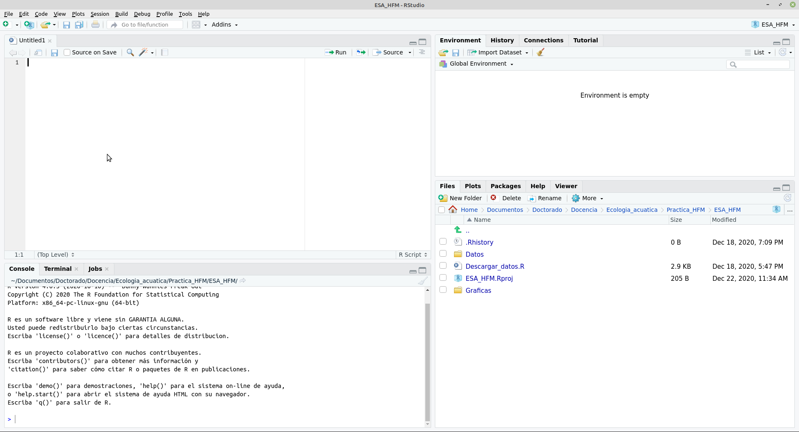
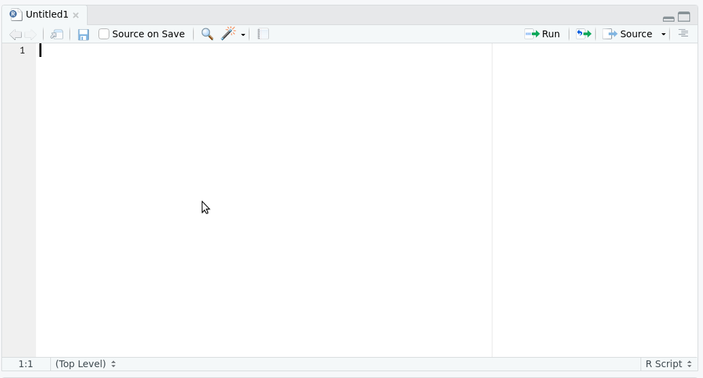
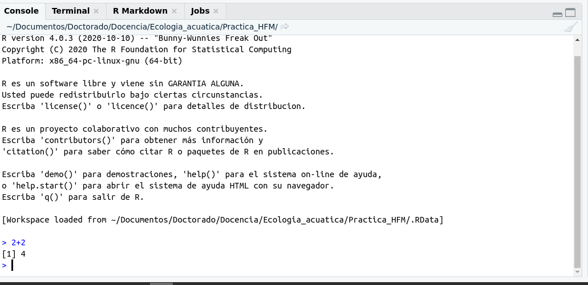
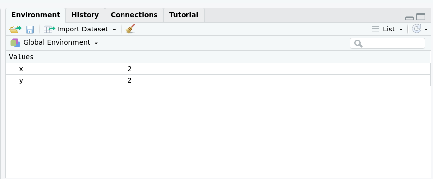
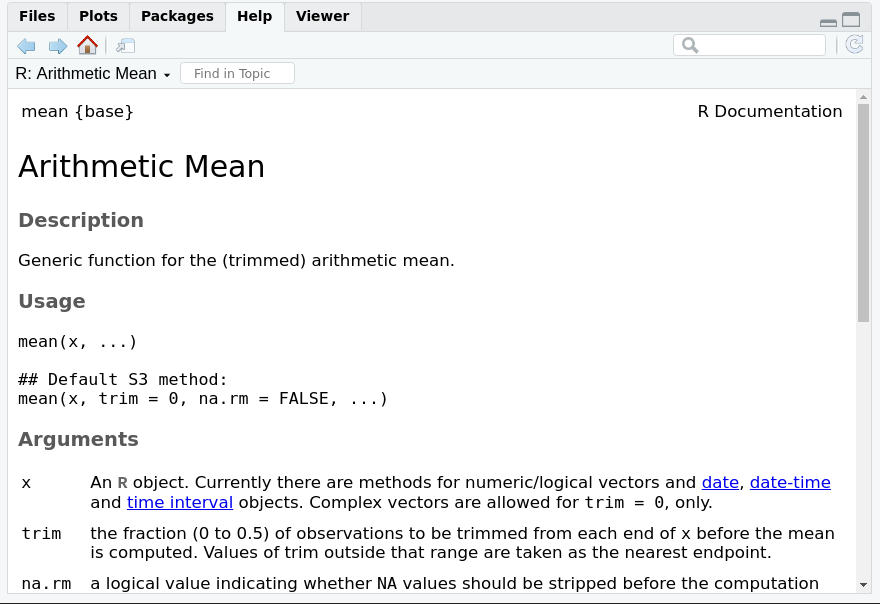

```{r setup, include=FALSE}
knitr::opts_chunk$set(echo = TRUE)
```

# Introducción

Debido al gran avance tecnológico de los últimos años, se ha conseguido una amplia variedad de dispositivos que permiten registrar una ingente cantidad de información con relativamente poco esfuerzo. Un ejemplo de esto, son los dispostivos que registran información de variables de interés (Ej: temperatura, humedad, irradiancia) a un determinado intervalo de tiempo y de manera autónoma. Muchos de estos dispositivos pueden ser instalados en lugares remotos y transmitir la información telematicamente o almacenarla en la memoria interna. Esto a supuesto un gran avance en el campo de la ecología acuática^[Por supuesto, esto ha revolucionado infinidad de campos como la biomedicina, ingeniería, informática, meterología, etc]. Cómo podeis imaginar, estos dispositivos han permitido obtener una gran cantidad de información con una resolución temporal (de incluso minutos o segundos) y durante grandes periodos de tiempo (meses/años) que sería impracticable mediante los métodos tradicionales. 


```{r, echo=FALSE,out.width="49%", out.height="20%",fig.cap="**Sistemas de monitoreo de alta frecuencia.** *Izquierda:* boya flotante que realiza medidas cada 10 minutos a una profundidas de 1.5 metros en el embalse de Sau (Barcelona). *Derecha:* boya flotante que realiza perfiles verticales desde la superficie hasta el fondo con un resolución espacial de 1 metro y una resolución temporal de 2 horas en el embalse de El Gergal (Sevilla).",fig.show='hold',fig.align='center'}
knitr::include_graphics(c("foto-sau.jpg","BoyaGergal.jpg"))
``` 


Los monitoreos de alta frecuencia (HFM) tienen muchas aplicaciones dentro de la ecología acuática, tanto en el ambito de la gestión como de la investigación. Por ejemplo, pueden ser usados para controlar la calidad del agua en un embalse que suministra agua potable a una ciudad, control de vertidos de una industria, estudiar el efecto de eutrofización en un lago de alta montaña o detectar cambios en las corrientes marinas.

Sin embargo, no todo es de color de rosas. Imaginaos que, después de dos años, vamos a recoger la información que ha almacenado nuestro sensor de temperatura y oxígeno disuelto que dejamos colocado en el centro de un lago de los pirineos. Al descargar la información, nos encotramos que tenemos 1.036.800 registros (porque claro está, queríamos registrar los datos cada segundo)... Echamos manos mano de nuestro amado Excel (Calc para los radicales del software libre) e intentamos calcular la temperatura media de esos dos años entre las 00:00 a las 08:00. A mí me ha entrado un sudor frío. Y es que, esta vasta y valiosa información tiene un inconveniente... tenemos que trabajar con miles o millones de datos. Por suerte, se disponen de muchas herramientas para trabajar con los datos. 

En esta práctica de Ecología de Sistemas Acuáticos, en la que vamos a trabajar con datos de HFM para estudiar la estructura térmica de un lago, me gustaría presentaros una herramienta, que a mi parecer, es fundamental para cualquier biólog@ y que os permitirá realizar todo el trabajo (desde organización de la información hasta su visualización, pasando por el análisis estadístico) con un solo software libre, de código abierto y gratuito. Estamos hablando de [R](https://www.r-project.org/). Para l@s que no lo conozcáis, Si buscáis R en google os aparecerá en las primera 4-5 entradas. Esto nos puede dar una idea de su relevancia a nivel mundial.

A partir de aquí, no os voy a engañar, R no es, por lo general, muy agradable y no suele despertar simpatías. ¡Echad un vistazo a la figura de abajo!


Sin embargo, cuando esos momentos de flaqueza acontezcan imaginad si sería posible hacerlo con otra herramienta y el tiempo que os llevaría. Además, cada vez que tengáis que hacer un estudio o evaluación necesitaréis usar Excel para ordenar los datos, SPSS (u otro programa de estadística) para el análisis y sigma plot (o similar) para hacer gráficas decentes. Mejor no hablamos de software específicos para cada campo: VENSIM, PRIME, Ocean Data VIew, SURFER, etc. A la larga el tiempo invertido habrá merecido la pena.

# Estructura de la práctica

  1. Obtener los datos con los que vamos a trabajar. Usaremos la red [The Global Lake Ecological Observatory Network (GLEON)](https://gleon.org/). Esta red pone a nuestra disposición una amplia cantidad de datos de monitoreo de alta frecuencia (HFM) de distintos lugares del mundo.
  2. Primeros pasos en R.
  3. Familiarizarnos con los paquetes y funciones básicos de R que nos permiten explorar y trabajar con grandes tablas de datos.
  4. Calcular profundidad de la termoclina y la estabilidad de la columna de agua (número de Smidch) usando el paquete de R [rLakeAnalyzer](https://cran.r-project.org/web/packages/rLakeAnalyzer/rLakeAnalyzer.pdf).
  5. Explorar y representar los resultados obtenidos.

# Descargar los datos de la red GLEON {#Descarga}

Para ello, visitamos la página de la red [GLEON](https://gleon.org/) y nos vamos al apartado de [datos](https://gleon.org/data). En esta sección podemos encontrar la [política de datos de GLEON](https://gleon.org/sites/default/files/pdf/data/2009_October_15_GLEON_data_access_policy.pdf), basicamente se apuesta por una ciencia colaborativa en la que los datos quedan a disposición de la comunidad para cualquier fin de investigación, académico, educativo o cualquier otro, siempre que no haya un interés lucrativo detrás y respetando algunos principios de comunicación con los responsables de los datos. Como se muestra en esta sección, a los datos de GLEON se puede acceder a través de tres buscadores [EDI](https://portal.edirepository.org/nis/home.jsp), [DataONE](https://search.dataone.org/data) o [Google data set](https://datasetsearch.research.google.com/).

Pues bien, para este práctica vamos a trabajar, en concreto, con datos del [lago Crystal](https://lter.limnology.wisc.edu/researchsite/crystal-lake). 
Así que utilizando el buscador que más sea de vuestro agrado lanzamos la siguiente busqueda: *crystal lake*.
Entre los resultados obtenidos (hay bastante información como podéis observar), vamos a seleccionar los datos derivados del proyecto [North Temperate Lakes Long Term Ecologycal Research (NTL-LTER)](https://lter.limnology.wisc.edu/index.php/) que nos ofrecen datos de temperatura, oxígeno disuelto, clorofila *a* y pH desde 2011 hasta 2014. Si no pudierais encontrarlos, podéis pinchar [aquí: North Temperate Lakes LTER High Frequency Water Temperature Data, Dissolved Oxygen, Chlorophyll, pH - Crystal Lake 2011 - 2014](https://portal.edirepository.org/nis/mapbrowse?packageid=knb-lter-ntl.303.20). 

En esa página que acabais de abrir tenéis un sumario con toda la información necesario sobre el paquete de datos (*Title, Creators, Publication Date, Citation, Abstract, Spatial Coverage, Package ID, Resources, Intellectual Rights, Digital Object Identifier, PASTA Identifier, Code Generation, Provenance, Journal Citations*). Las que más nos van a interesar por el momento son *Abstract, Resources y Code Generation*. La primera de ellas es un resumen que nos explica como han sido recogido los datos y algunas particularidades que debemos saber, en la segunda tenemos directamente los archivos con los datos para descargarlos en formato \*.csv y una opción muy interesante, [*View Full Metadata*](https://portal.edirepository.org/nis/metadataviewer?packageid=knb-lter-ntl.303.20), en la que si desplegamos *Data Entities* podemos ver información sobre las variables que aparecen en la tabla de datos como, por ejemplo, las unidades en las que están medidas.

En este caso, disponemos solo de un fichero. Para descargar los datos tenemos dos opciones:

  1. Podemos pinchar directamente en el archivo y descargarlo a través del navegador. *Name:* High Resolution Water Temperature Dissolved Oxygen Chlorophyll pH - Crystal Lake *File:* ntl303_v1_0.csv  (120.5 MiB; 22 downloads) . Si optamos por esta opción, posteriormente habrá que importar los datos a R.
  2. Otra opción mucho más cómoda es la de usar un script de R que ya nos han preparado para facilitarnos la descarga e importación. Para ello, tenemos dos opciones también: 
  + Pinchamos en el [icono de R](https://portal.edirepository.org/nis/codeGeneration?packageId=knb-lter-ntl.117.38&statisticalFileType=r) en el apartado *Code Generation*. 
  + Pinchamos en la opción [tidyr](https://portal.edirepository.org/nis/codeGeneration?packageId=knb-lter-ntl.303.20&statisticalFileType=tidyr) en el apartado *Code Generation*. Os recomiendo usar esta última, es la que vemos más abajo y, además, si no lo tenemos instalado, instala automaticamente el paquete [Tidyverse](https://www.tidyverse.org/). `Tidyverse` es en realidad un conjunto de paquetes de R especialmente diseñado para la ciencia de datos que nos vendrá de maravilla para esta práctica.
  
  Independientemente por cual os decantéis, debéis abrir el archivo pinchando en *File Download: knb-lter-ntl.303.20.r* o *File Download: knb-lter-ntl.303.20.tidyr* y se abrirá automaticamente con R, si no es así, lo descargáis y lo abris posteriormente con R. Una vez abierto ya podéis ejecutar el script (`Ctrl+A` y después `Crtl+Enter`).
  Como véis también hay opción para descargar y trabajar directamente los datos con otras herramientas, si a alguno le pica la curiosidad ¡adelante!. En esta práctica como hemos dicho vamos a usar R, debido a que es una herramienta gratuita, de código abierto y libre. Además es ampliamente usado en investigación debido a su naturaleza libre y colaborativa. En fin, si más dilaciones, podéis decargar el script, abrirlo con RStudio y ejecutarlo ¡A ver qué pasa!.
  
Esta es la pinta que tiene el script:
```{r eval = FALSE}
# Package ID: knb-lter-ntl.303.20 Cataloging System:https://pasta.edirepository.org.
# Data set title: North Temperate Lakes LTER High Frequency Water Temperature Data, Dissolved Oxygen, Chlorophyll, pH - Crystal Lake 2011 - 2014.
# Data set creator:  John Magnuson - University of Wisconsin 
# Data set creator:  Stephen Carpenter - University of Wisconsin 
# Data set creator:  Emily Stanley - University of Wisconsin 
# Data set creator:  NTL Lead PI - University of Wisconsin 
# Metadata Provider:  NTL Information Manager - University of Wisconsin 
# Contact:  NTL Information Manager -  University of Wisconsin  - ntl.infomgr@gmail.com
# Contact:  NTL Lead PI -  University of Wisconsin  - ntl.leadpi@gmail.com
# Stylesheet for metadata conversion into program: John H. Porter, Univ. Virginia, jporter@Virginia.edu 
#
#install package tidyverse if not already installed
if(!require(tidyverse)){ install.packages("tidyverse") }  
library("tidyverse") 
infile1 <- trimws("https://pasta.lternet.edu/package/data/eml/knb-lter-ntl/303/20/b9b3b932deec8f3e71fb8d70cacf6a0e") 
infile1 <-sub("^https","http",infile1)
# This creates a tibble named: dt1 
dt1 <-read_delim(infile1  
                 ,delim=","   
                 ,skip=1 
                 , col_names=c( 
                   "sampledate",   
                   "year4",   
                   "daynum",   
                   "sample_time",   
                   "depth_calculated",   
                   "wtaer_temp",   
                   "flag_water_temp",   
                   "pH",   
                   "flag_ph",   
                   "chlorophylla",   
                   "flag_chlorophylla",   
                   "opt_do2",   
                   "flag_do2",   
                   "opt_dosat_raw",   
                   "flag_opt_dosat_raw"   ), 
                 col_types=list(
                   col_character(), 
                   col_number() , 
                   col_number() , 
                   col_character(), 
                   col_number() , 
                   col_number() ,  
                   col_character(), 
                   col_number() ,  
                   col_character(), 
                   col_number() ,  
                   col_character(), 
                   col_number() ,  
                   col_character(), 
                   col_number() ,  
                   col_character()), 
                 na=c(" ",".","NA")  )


# Observed issues when reading the data. An empty list is good!
problems(dt1) 
# Here is the structure of the input data tibble: 
glimpse(dt1) 
# And some statistical summaries of the data 
summary(dt1) 
# Get more details on character variables

summary(as.factor(dt1$flag_water_temp)) 
summary(as.factor(dt1$flag_ph)) 
summary(as.factor(dt1$flag_chlorophylla)) 
summary(as.factor(dt1$flag_do2)) 
summary(as.factor(dt1$flag_opt_dosat_raw))
```

Esta primera parte del script es para descargar los datos (igual que arriba, salvo que me he tomado el tiempo de comentar algunas líneas):

```{r eval = FALSE}
# Package ID: knb-lter-ntl.303.20 Cataloging System:https://pasta.edirepository.org.
# Data set title: North Temperate Lakes LTER High Frequency Water Temperature Data, Dissolved Oxygen, Chlorophyll, pH - Crystal Lake 2011 - 2014.
# Data set creator:  John Magnuson - University of Wisconsin 
# Data set creator:  Stephen Carpenter - University of Wisconsin 
# Data set creator:  Emily Stanley - University of Wisconsin 
# Data set creator:  NTL Lead PI - University of Wisconsin 
# Metadata Provider:  NTL Information Manager - University of Wisconsin 
# Contact:  NTL Information Manager -  University of Wisconsin  - ntl.infomgr@gmail.com
# Contact:  NTL Lead PI -  University of Wisconsin  - ntl.leadpi@gmail.com
# Stylesheet for metadata conversion into program: John H. Porter, Univ. Virginia, jporter@Virginia.edu 
#
#install package tidyverse if not already installed. Aquí cargamos el conjunto de paquetes que están dentro de "tidyverse" y si no lo tuvieramos instaldo, han pensado en nosotros y, se instala solo.
if(!require(tidyverse)){ install.packages("tidyverse") }  
library("tidyverse") 
infile1 <- trimws("https://pasta.lternet.edu/package/data/eml/knb-lter-ntl/303/20/b9b3b932deec8f3e71fb8d70cacf6a0e") 
#Esta, de arriba, es la dirección de donde descarga los datos
infile1 <-sub("^https","http",infile1)
# This creates a tibble named: dt1 
dt1 <-read_delim(infile1  #Crea un objeto donde descarga los datos de la dirección que le damos, guardada en el objeto con nombre "infile1"
                 ,delim=","   
                 ,skip=1 
                 , col_names=c(        #Asigna nombre a las columnas
                   "sampledate",   
                   "year4",   
                   "daynum",   
                   "sample_time",   
                   "depth_calculated",   
                   "wtaer_temp",   
                   "flag_water_temp",   
                   "pH",   
                   "flag_ph",   
                   "chlorophylla",   
                   "flag_chlorophylla",   
                   "opt_do2",   
                   "flag_do2",   
                   "opt_dosat_raw",   
                   "flag_opt_dosat_raw"   ), 
                 col_types=list(
                   col_character(), 
                   col_number() , 
                   col_number() , 
                   col_character(), 
                   col_number() , 
                   col_number() ,  
                   col_character(), 
                   col_number() ,  
                   col_character(), 
                   col_number() ,  
                   col_character(), 
                   col_number() ,  
                   col_character(), 
                   col_number() ,  
                   col_character()), 
                 na=c(" ",".","NA")  )
               
```

Este trocito de código que sigue es para corregir algún problema de formato que se haya podido introducir debido a algún error en la base de datos.

```{r eval = FALSE}
# Observed issues when reading the data. An empty list is good!
problems(dt1) 
```                

Este último trozo es simplemente para ver la estructura de los datos y un resumen de cada una de la variables. Este trozo no es necesario que lo ejecutéis.

```{r eval = FALSE}
# Here is the structure of the input data tibble: 
glimpse(dt1) 
# And some statistical summaries of the data 
summary(dt1) 
# Get more details on character variables

summary(as.factor(dt1$flag_water_temp)) 
summary(as.factor(dt1$flag_ph)) 
summary(as.factor(dt1$flag_chlorophylla)) 
summary(as.factor(dt1$flag_do2)) 
summary(as.factor(dt1$flag_opt_dosat_raw))
```

Bien, una vez ejecutado el script, ya debemos tener los datos en nuestro entorno de RStudio en un tipo de objeto denominado data.frame (básicamente una tabla de datos). Vamos a ver que pinta tienen:

```{r eval = FALSE}
head(dt1)
```

Por último, los vamos a guardar en la carpeta "Datos_descargados" que hemos creado.

```{r eval = FALSE}
#write.csv(dt1, "./Datos/Datos_Crystal.csv", row.names = FALSE)
```

<div class="ejercicios">
<h2 class="texto">Tarea</h2>
<p class="texto">En los datos que acabamos de descargar, la información de cada variable (oxígeno disuelto, temperatura, etc) solo aparece para una profundidad.</p>
<p class="textoC">Busca información de temperatura del agua medida a distintas profundidades en el Lago Trout. El periodo de tiempo debe ser desde 2004 hasta la actualidad (el mismo periodo que ya tenemos).</p>
<p class="texto">Pega el enlace en un archivo un súbelo al campus virtual antes de las 23:59 h del martes 19 de mayo.</p></div>

# Primero pasos

A estas alturas es posible que ya se haya generado una histeria colectiva. A la mayoría de vosotr\@s ya os habrá dado algún error y, a l\@s que no, esa cantidad de código ininteligible os habrá quitado las ganas de vivir. ¡Que no cunda el pánico!

Vamos a ver alguna nociones básicas sobre R. Si os preguntáis porqué ahora y no antes: porque hasta que no surgen las dudas, no tiene sentido dar las respuestas.



RStudio es una IDE (entorno de desarrollo integrado) para R. En román paladino, RStudio nos permite usar R de una manera más intuitiva y con muchas herramientas que nos facilitan la vida. Como vamos usar RStudio para comunicarnos con R, cada vez que hablemos de R vamos a referirnos indistintamente a R y a RStudio. Bien, pues en la imagen de arriba vemos 4 subventanas. Veamos una a una:



En esta ventana se muestra el script. El script no es, ni más ni menos, que una hoja donde vamos escribiendo todas las ordenes que le queremos dar a R. Nos permite ir guardando todo lo que hacemos, modificar sobre lo que ya hemos hecho, ejecutar sólo la parte que nos interesa y organizar la información. Vamos a escribir nuestra primera línea en R, usándolo como una simple calculadora (pincha sobre el recuadro `code` para ver el código):

```{r}
2+2
```

Si escribís 2+2 y pulsáis `Ctrl+Enter` se ejecuta solo la línea en la que estamos. Veréis que el resultado (4) os aparece en la ventana consola:



Como podéis intuir la consola es donde tiene lugar la parte importante. En ella se ejecutan las ordenes, nos informa de los errores y nos devuelve la información que le pedimos.

Volvamos al script. R es una lenguaje orientado a objetos, esto se traduce en que vamos a ir guardando la información en "objetos" virtuales y vamos a trabajar con estos objetos. Siguiente el ejemplo anterior, vamos a crear nuestros primeros objetos:

```{r}
x <- 2
y <- 2
```

Hemos creado dos objetos, una llamado `x` y otro llamado `y`. Ambos guardan la información del valor 2. Además, si os habéis fijado, en la ventana superior derecha os han aparecido esos dos objetos:



Ahora vamos a sumar estos dos objetos:

```{r}
x+y
```

¡Enhorabuena! ya habéis creado vuestro primeros objetos en R y habéis trabajado con ellos. Ahora vamos a sacarle más partido a esto. Como imaginaréis, en un objeto de R se puede almacenar muchas más información que un sólo número. Vamos a imaginar que tenemos información sobre la temperatura del agua medida en distintos sistemas epicontinentales y queremos guardar esa información en un objeto llamado `Temperatura`:

```{r}
Temperatura <- c(23, 23.5, 20, 25)
```

Ahora vamos a calcular la temperatura media y su desviación:

```{r}
mean(Temperatura)
sd(Temperatura)
```

¡Ojo! R es muy quisquilloso y si no le dais el nombre exacto de `Temperatura` (incluyendo mayúculas y minúsculas) no os entenderá y os devolverá un error. Por lo tanto, sed muy cuidadosos con la sintaxis y revisad que todo está escrito correctamente (que no falte ningún paréntesis o corchete).

En estas últimas líneas han sucedido un par de cosas: hemos creado un objeto nuevo, un vector, y hemos usado dos funciones `mean()` y `sd()` que calculan la media y desviación estándar.

Un vector almacena información de un mismo tipo, en este caso númerico. Existen distintos tipos de vector en función de la información que almacen:

  1. Númerico: almacenan números.
  2. Caracter: almacenan texto.
  3. Factores: almacenan factores, generalmente texto pero que usaremos como un tratamiento en el análisis. 
  4. Fechas: almacenan fechas en distintos formatos.
  
En cuanto a las funciones, existen infinidad de ellas. R trae muchas funciones básicas pero si queremos aplicar funciones más especificas necesitaremos instalar paquetes que han sido creados específicamente para ello.

La estructura genérica de una función sería. 

```{r, eval = F}
nombre_funcion(x = objeto_donde_aplicarla, argumento1 = "valor1", argumento2 = "valor2")
```

Si queremos obtener más información sobre una función y su uso podéis usar la función `help("funcion_que_os_interesa")` o más cómodo `?funcion_que_os_interesa`:

```{r}
?mean
```
  
Veréis que se os abrirñá la última ventana que nos quedaba por ver:



Aquí encontréis la información necesaria para usar la función así como algunos ejemplos.

Por último, vamos a ver otro objeto muy útil: `data.frame`. Un data.frame no es más que una tabla de datos, como la que acostumbráis a hacer en Excel. Veamos un ejemplo:

Ya tenemos la temperatura del agua que se ha registrado en distintos sistemas epicontinentales (`Temperatura`). Ahora nos dan la información del tipo de sistema y queremos crear un tabla que recoja toda la información:

```{r}
Temperatura <- c(23, 23.5, 20, 25)
Sistemas <- c("Lago", "Lago", "Rio", "Rio") #Creamos un vector esta vez de tipo caracter (el texto va entre comillas)

Temperatura_en_distintos_sistemas <- data.frame(Temperatura,
                                                   Sistemas)
View(Temperatura_en_distintos_sistemas) #La función View() nos muestra el objeto que deseemos.
```

Se os abrirá una ventana con la información recogida en el data.frame `Temperatura_en_distintos_sistemas`. En este último trozo de código habeís visto un elemento nuevo: comentarios. Es altamente recomendado comentar el código que estamos escribiendo. De este modo, será mucho más claro y cuando vuelvas a abrir el script después de meses "tu yo del futuro" te lo agradecerá. Además si queréis compartir código con otr\@s compañer\@s es necesario añadir comentarios para que sepan que hacemos en cada sección. Para comentar, como habéis visto, sólo hay que añadir `#` delante del texto y este no se ejecutará. Si no ponéis `#` R lo entenderá como una orden y os dará error.

Otra cosa que habréis podido notar es que, aunque R nos ayuda autocompletando la frase, el nombre `Temperatura_en_distintos_sistemas` no es muy funcional que se diga. Es más práctico usar nombres cortos, pero nos indiquen claramente de que se trata, a la hora de nombrar objetos en R. 

A la hora de nombrar objetos en R algunas nombres que debemos respetar.

  1. Los nombres no pueden ser números o empezar con número. No podríamos usar `1` ó `2` ni `2datos`, pero sí podríamos usar `datos2`.
  2. No se usar caracteres especiales: #, !, @, etc.
  3. Los espacios tampoco pueden ser usado dentro de los nombres. Usar en su lugar mayúsculas ó barra baja. Por ejemplo, usar `DatosLagos` o `Datos_lagos` en lugar de `Datos lagos`.

```{r}
Temperatura <- c(23, 23.5, 20, 25)
Sistemas <- c("Lago", "Lago", "Rio", "Rio") #Creamos un vector esta vez de tipo caracter (el texto va entre comillas)

Temp_sistemas <- data.frame(Temperatura,
                                                   Sistemas)
View(Temperatura_en_distintos_sistemas) #La función View() nos muestra el objeto que deseemos.
```

¡Genial! Ya hemos visto los objetos básicos. Irán saliendo más a lo largo de la práctica, pero por ahora es suficiente.

## Ejercicios

  1. ¿Qué sucede si corremos `Sistemas[2]`? Prueba con distintos números.
  2. ¿Y si corremos Temp_sistemas[2]? Da error... prueba Temp_sistemas[,2] ¿Y si ponemos un número delante de la `,`? ¿Que indican los números que van delante de la coma y los que van detrás?
  3. Además de la temperatura se midió el pH: 7.8, 7.5, 9 y 8.5. Incluye estos valores en el data.frame `Temp_sistemas`. Hazlo con los conocimientos que tienes y luego prueba con la función `cbind()`.
  2. Nos dan también la concentración de clorofila a, pero en este caso falta un datos y lo rellenamos con `NA`, que significa que no está disponible. `Cla <- c(15.6, NA, 3, 4)`. Calcula la concentración de clorofila media. Recuerda, cuando tengas dudas sobre como utilizar una función: `?mean`.

# Paquetes importantes y sus funciones básicas

Ya hemos dado nuestros primeros pasos en R, conocemos su entorno RStudio, hemos creado nuestros primeros objetos y aplicado un par de funciones básicas. Ahora vamos a dar un paso más allá y vamos a ver algunos de lo más paquetes que pueden ser más importantes para nosotros y sus funciones más útiles.

Para esta parte de la práctica ya debemos haber descargado los datos de la plataforma GLEON como se indicó en la [sección 3](#Descarga).

Lo primero que nos preguntaremos, ¿Qué es un paquete? Un paquete de R es un conjunto de funciones que han sido creadas con un objetivo común, por ejemplo hacer gráficas, y que han sido agrupadas para que puedan ser cargadas en R todas juntas.

Para instalar un paquete no tenemos mas que ejecutar:

```{r, eval = FALSE}
install.packages("nombre_del_paquete")
``` 

## Importar datos

La mayoría de los paquetes que vamos a ver durante la práctica han sido agrupados en una colección de paquetes que nos permite instalarlos y cargarlos todos juntos. Esta colección de paquetes se llama [*tidyverse*](https://www.tidyverse.org/). El primer paquete que vamos a ver es [`readr`](https://cran.r-project.org/web/packages/readr/readr.pdf).
Si aún no hemos instalado `tydiverse`:

```{r, eval = FALSE}
install.packages("tidyverse")
``` 

Si ya lo tenemos instalado, solo tenemos que "llamarlo" o cargarlo. Cada vez que abrimos una sesión de R hay que cargar los paquetes que vayamos a usar durante la sesión. No es necesario volver a instalarlos pero sí hay cargarlos usando la función `library()`:

```{r, eval = FALSE}
#Library. Al principio de nuestro scrip creamos un apartado donde iremos cargando los paquetes nos hacen falta.
library(readr) #Si solo quisieramos cargar el paquete readr.
``` 

```{r}
#Library. Al principio de nuestro scrip creamos un apartado donde iremos cargando los paquetes nos hacen falta.
library(tidyverse) #De esta forma, todos los paquetes que agrupa tydiverse: ggplot2, readr, dplyr, etc. Yo usaría esta.
``` 
Vemos que al cargar `tydiverse` nos informa de qué paquetes han sido cargados y algunas funciones que tienen conflicto con otros paquetes.
Una vez cargado el paquete, la primera función que vamos a necesitar es `read_csv()`. Esta función nos permite importar tablas que se han guardado en formato `.csv`. Al principio de la práctica, creamos un proyecto de R, descargamos los datos de la plataforma y los guardamos en la carpeta `Datos` de nuestro directorio. Si guardasteis vuestro espacio de trabajo al salir, tendreis un objeto llamado `dt1`. Pero si no guardasteis, tendremos que importar los datos de nuevo y, además, aprovechamos para ponerle un nombre que nos sea más evocador que `dt1`, usaremos, por ejemplo, `Crystal`:

```{r}
Crystal <- read_csv("Datos/Datos_Crystal.csv")
```

Al importar el archivo, la función reconoce automaticamente el tipo de elementos que se guarda en cada columna. Por ejemplo, la columna sampledate es de tipo fecha, mientras que year y depth_calculated son `doubles` que vienen a ser valores númericos no enteros (double no es más que la forma en la que ese número se expresa en forma binaria usando 64 bits).

No os preocupeis por el aviso (warnings) que nos da, nos aviso de que esperaba encontrar un tipo de valor en una columna que no se corresponde con lo que ha entrado. A nosotros no nos preocupa la información que hay en esa columna ^[Si no sabéis que información guarda esa columna, acordaos de que podéis mirar en los metadatos de la página donde descargasteis los datos.].

Vamos a ver un resumen de la información que tenemos disponible en la tabla de datos.

```{r}
#Vistazo general
summary(Crystal)
```

R nos muestra para cada columna los valores mínimos, máximos, la media, la mediana y los cuartiles 1 y 3. Además, también nos dice cuantos valores faltan (NA's). Recordad que podéis usar la función `View()` para ver los datos directamente, también podéis hacer doble click sobre el objeto `dt1`.

## Organizar tablas

Una cosa está clara, tenemos mucha información y, además, el archivo es bastante pesado, casi 140 MB. Vamos a centrarnos sólo en un año, 2012 por ejemplo. Para ello vamos a tirar mano de otro paquete: `dplyr`. Este es otro de los que ya viene preparado con `tidyverse`, por lo que tendremos que cargarlo. Este paquete es muy util para organizar, filtrar y transformar la información de las tablas, aquí os dejo un "chuleta" con las funciones principales: [chuleta dplyr](https://raw.githubusercontent.com/rstudio/cheatsheets/master/data-transformation.pdf). Como queremos filtrar los datos y quedarnos solo con los del año 2012, vamos a usar la función `filter()`.

```{r}
#Nos quedamos sólo con los datos del 2012
Crystal_2012 <- filter(Crystal, year4 == 2012)
rm(Crystal) #Aprovechamos para eliminar el otro objeto que no nos va a servir.
```

### Ejercicios: 
  1. *Filtra la tabla para quedarte con los datos del 2013.*
  2. *Filtra la tabla para quedarte solo con los datos que fueron tomados a un metro de profundidad.*


## Gráficas
¡Perfecto! Ahora vamos a hacer alguna gráfica. Para ello vamos a usar otro paquete, también incluido en tidyverse, `ggplot2`. Aquí os dejo otra chuleta para usar este paquete ([pincha aquí](https://raw.githubusercontent.com/rstudio/cheatsheets/master/data-visualization-2.1.pdf)). ¿Habrá cambios en la temperatura del agua a lo largo del año? Echemos un vistazo:

```{r}
ggplot(Crystal_2012, aes(x = sampledate, y= wtaer_temp))+ #Aquí indicamos donde está la información que queremos representar (Crystal_2012) y que variables x e y
  geom_point() #Aquí indicamos el tipo de gráfico, en este caso hemos elegido puntos
```

Ummm... El es un poco extraño. ¿Y si seleccionamos sólo la temperatura que tenemos a 1 metro de profundidad?

```{r}
Crystal_temp_1m <- filter(Crystal_2012, depth_calculated == 1)
ggplot(Crystal_temp_1m, aes(x = sampledate, y= wtaer_temp))+
  geom_point()
```

Algo mejor. Vemos que la temperatura aumenta durante la primavera y que vuelve a caer cuando se entra en el otoño. Sin embargo, a parte del patrón general, se puede observar un patrón secundario. Quizás se deba a oscilaciones diarias. Para ver eso tenemos que seleccionar la temperatura a la profundiad de 1 metros y un solo día. Con la función filter podemos hacer eso.

```{r}
Temp_1m_1dia <- filter(Crystal_2012, depth_calculated == 1 & daynum == 260) #Yo he elegido el día 260 (16 de septiembre)
ggplot(Temp_1m_1dia, aes(x=sampledate, y = wtaer_temp))+
  geom_point()
```

Parece que sí, como cabría esperar la temperatura baja por la noche y sube por el día. Además hemos aprendido una cosa nueva en R: los operadores. Os dejo los más comunes:

+----------+-----------------------+
| Operador |  Descripción          |
+==========+=======================+
|   \>     | mayor que             |
+----------+-----------------------+
|   <      | menor que             |
+----------+-----------------------+
|   \>=    | mayor o igual que     |
+----------+-----------------------+
|   <=     | menor o igual que     |
+----------+-----------------------+
|   ==     | exactamente igual que |
+----------+-----------------------+
|   !=     | distinto a            |
+----------+-----------------------+
| x & y    | x e y                 |
+----------+-----------------------+
| x | y    | x o y                 |
+----------+-----------------------+
   
  

Ahora, vamos a hacer algunos arreglos estéticos (cambiar el nombre de los ejes, el fondo)

```{r}
ggplot(Temp_1m_1dia, aes(x = sampledate, y= wtaer_temp))+ #Aquí indicamos donde está la información que queremos representar (Crystal_2012) y que variables x e y
  geom_point()+ #Aquí indicamos el tipo de gráfico, en este caso hemos elegido puntos
  labs(x = "Fecha", y = "Temperatura", title = "Temperatura a 1 m de profundidad")+ #Aquí  podemos modificar las etiquetas del gráfico.
  theme_classic() #Esta función usa un "tema" predefinido para la gráfica
```

Ya tiene mejor pinta. Vamos a ver si se comporta igual a distinta profundida. Para ello, solo tenemos que decirle a ggplot que nos haga una gráfica por cada profundidad usando `facet_wrap()`.

```{r}
Crystal_temp_dia260 <- filter(Crystal_2012, daynum == 260)
ggplot(Crystal_temp_dia260, aes(x = sampledate, y= wtaer_temp))+ #Aquí indicamos donde está la información que queremos representar (Crystal_2012) y que variables x e y
  geom_point()+ #Aquí indicamos el tipo de gráfico, en este caso hemos elegido puntos
  labs(x = "Fecha", y = "Temperatura", title = "Temperatura a 1 m de profundidad")+ #Aquí  podemos modificar las etiquetas del gráfico.
  facet_wrap(~depth_calculated)+ #En esta línea le indicamos que haga una gráfica por cada profundidad.
  scale_x_datetime(date_labels = "%R")+ #He añadido esta línea para que el formato de la fecha ponga solo la hora.
  theme_classic() #Esta función usa un "tema" predefinido para la gráfica
```

Aquí podemos ver varias cosas interesantes. Por un lado, la temperatura parece oscilar a lo largo del día (día-noche) sólo en las capas más superficiales pero en las capas profundas la variación es mínima ¿alguna idea? ¿Podría estar la masa de agua estratificada? Lo veremos más adelante... Por otro lado, vemos que la cantidad de información (puntos) no es la misma en cada profundidad, a 1 metros tenemos muchos más registros de temperatura que a 10 o 12 metros. Vamos a comprobar si es algo general para todos los días:

```{r}
#Contamos el número de filas que hay para cada profundidad y día
Test_profundidades <- Crystal_2012 %>% group_by(daynum, depth_calculated) %>% summarise(n_filas = n())
#Lo representamos en una gráfica
ggplot(Test_profundidades, aes(x = depth_calculated, y = n_filas))+
  geom_point()+
  labs(x = "Profundidad", y = "Número de filas")+
  theme_classic()

```

Vemos que en las profundidades de 0 metros y 1 metro hay muchos más registros que en el resto. Por lo tanto, la variabilidad diaria puede no estar igual de bien recogida para todas las profundades. En la siguiente sección vamos a selecionar una franja horaria y a obtener un valor medio por profundidad.

En el código que acabamos de ejecutar habréis encontrado algunos elementos nuevos. Tres funciones nuevas, `group_by()`, `summarise()` y `n()`, que nos permiten agrupar en función de las variables que queramos, resumir la información de la tabla y contar el número de elementos que hay en un grupo, respectivamente. Y un nuevo operador denominado "pipe", `%>%`. El operador `%>%` nos permite concatenar funciones de una manera más fácil de visualizar. Lo vemos con un ejemplo más sencillo:

```{r}
#Si queremos seleccionar la variable temperatura pero sólo de la profundidad de 1 metro
#Puedo hacerlo inclyendo funciones dentro de funciones:
select(filter(Crystal_2012, depth_calculated == 1), daynum)
#O concatenandolas:
Crystal_2012 %>% filter(depth_calculated == 1)  %>% select(daynum)
#Esta última es más fácil de entender.
```

### Ejercicios
  1. *Representa otra variable, la que a tí te apetezca. Ej: oxígeno disuelto.*
  2. *Prueba, en lugar de theme_classic(), otro tema diferente: por ejemplo: `theme_ligth()`.*
  3. *Prueba a usar `geom_line()` en lugar de `geom_point()`.*
  4. *¿Y si en lugar de "%R" usáis "%H"? Ejecuta `?strptime` y mira los formatos disponibles. Experimenta con ellos.*
  5. *Si ya estas muy mosquead\@ con R (cosa que entiendo perfectamente), prueba a abrir la tabla con excel y repesentar la temperatura en el lago Crystal en cada profundidad para el día 260 del año 2012.*
  

## Trabajar con fechas

Como dijimos en la sección anterior, vamos a obtener un valor medio de temperatura por profundidad y día. Para trabajar con fechas, horas, etc. en R tenemos un paquete que nos facilita la vida: [`lubridate`](https://cran.r-project.org/web/packages/lubridate/lubridate.pdf). Para este paquete también disponemos de "chuleta", [aquí os la dejo](https://raw.githubusercontent.com/rstudio/cheatsheets/master/lubridate.pdf). Este paquete, aunque también se instala con tidyverse, hay que cargarlo de manera independiente.

```{r}
library(lubridate)
```

En la columna `sampledate` tenemos recogida la información de la fecha y la hora a la que se tomó la medida. Con el paquete `lubridate` podemos extraer esta información de manera sencilla:

```{r, eval = FALSE}
date(Crystal_2012$sampledate) #Nos da la fecha
hour(Crystal_2012$sampledate)#Nos da la hora
minute(Crystal_2012$sampledate) #Nos da los minutos
yday(Crystal_2012$sampledate) #el día del año
```

Con esta pequeña presentación y uniendo lo que hemos visto hasta ahora, quizás, podríamos intentar calcular la temperatura media de cada profundidad para cada día teniendo en cuenta sólo los valores medidos entre las 11:00 de la mañana y las 16:00 de la tarde.

Vamos a intentarlo:

```{r}
#nos quedamos sólo con las muestras tomadas entres las 11:00 y las 16:00
Crystal_dia <- Crystal_2012 %>% filter(hour(sampledate) >= 11 & hour(sampledate) <= 16)
#Calculamos la temperatura media por día y profundidad
Crystal_dia %>% group_by(daynum, depth_calculated) %>% summarise(mean(wtaer_temp))
```

¡Perfecto!¡Ya lo tenemos! Si le echáis un vistazo a la chuleta que os dejé del paquete [`dplyr`](https://raw.githubusercontent.com/rstudio/cheatsheets/master/data-transformation.pdf), hay dos funcions que nos pueden resultar interesantes: `between()` y `summarise_if()`. La primera nos simplifica la vida cuando queremos filtrar dentro de un rango determinado y la segunda nos permite calcular la media de todas las variables numéricas de una vez.

Solución:
```{r}
#Lo he recogido todo en una sola línea.
Crystal_dia <- Crystal_2012 %>% filter(between(hour(sampledate), 11, 16)) %>% group_by(daynum, depth_calculated) %>% summarise_if(is.numeric, mean, na.rm = TRUE)

```

## Ejercicios 

1. Intenta aplicar la función `between()` para filtrar tabla y quedarnos solo con los valores que están entre las 11:00 y las 16:00.
2. Intenta aplicar la función `summarise_if()` para calcular la media, no sólo de la temperatura del agua, si no de todas las variables numéricas que tenemos.
